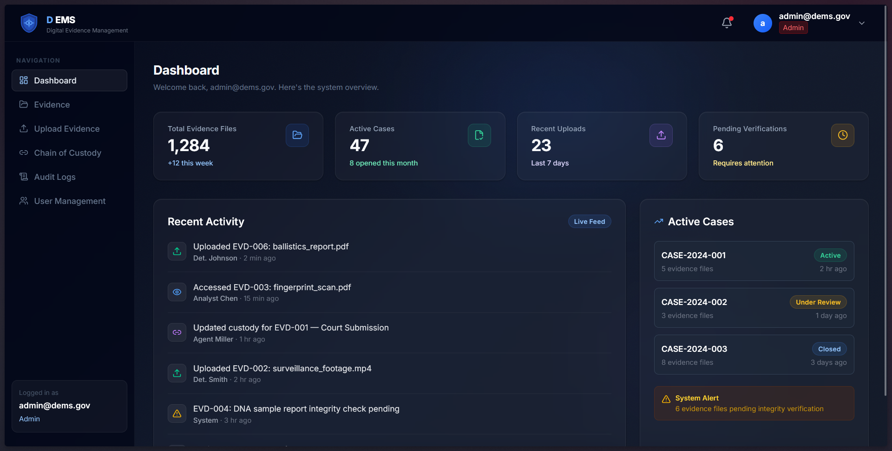
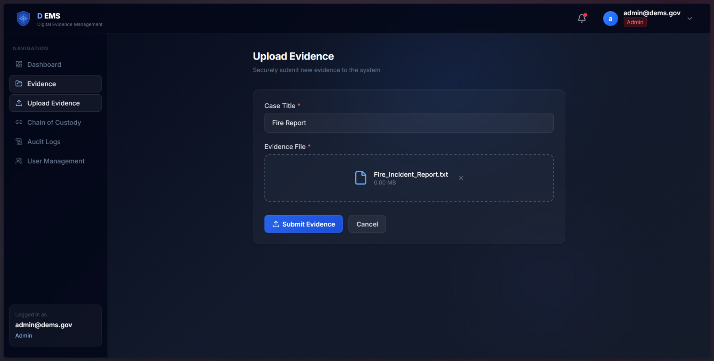
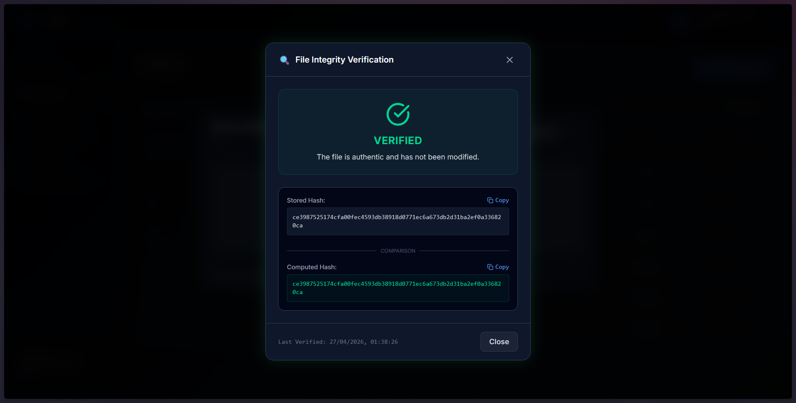
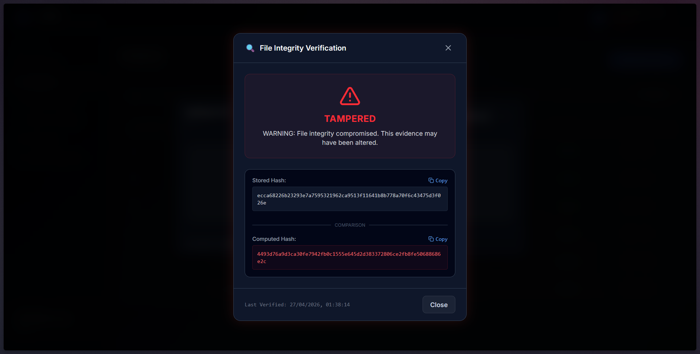
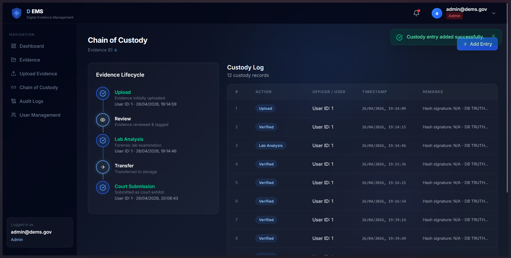
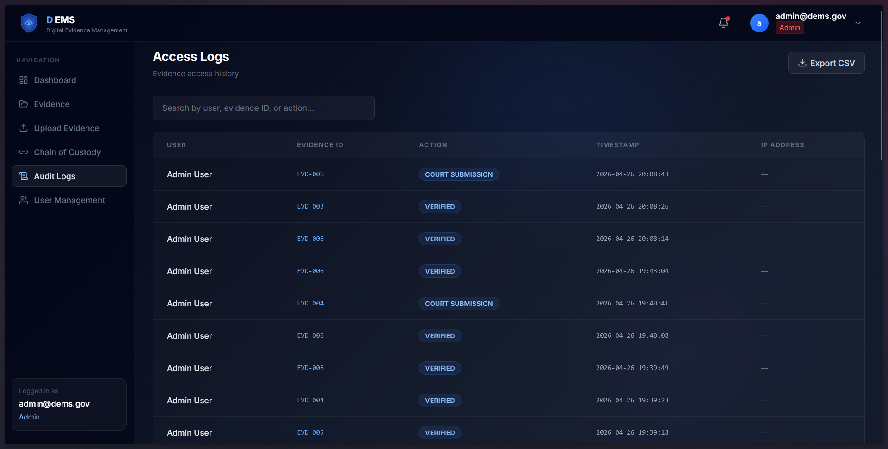

# 🔐 Digital Evidence Management System (DEMS)

A secure system for managing digital evidence with hash-based integrity verification, audit logs, and chain of custody tracking.

## 📌 Project Overview

The **Digital Evidence Management System (DEMS)** is a secure and
reliable platform developed as part of a DBMS project.\
It is designed to **store, manage, and verify digital evidence** while
maintaining **data integrity, auditability, and chain of custody**.

This system simulates real-world forensic workflows where digital
evidence must remain **tamper-proof and traceable**.

---

## 📸 Screenshots

### 🏠 Dashboard Overview

Clean and intuitive dashboard displaying system statistics, recent activity, and active cases.



---

### 🔐 Evidence Upload System

Secure file upload interface with case tagging and seamless submission.



---

### ✅ File Integrity Verification (Valid File)

System verifies uploaded files using SHA-256 hashing to ensure authenticity.



---

### ⚠️ Tampered File Detection

If a file is modified, the system instantly detects hash mismatch and raises a warning.



---

### 🔗 Chain of Custody Tracking

Tracks complete lifecycle of evidence including upload, review, analysis, and court submission.



---

### 📜 Audit Logs

Maintains detailed logs of all system activities for transparency and accountability.




## 🚀 Key Features

### 🔑 1. Evidence Upload with Hashing

-   Upload digital files securely
-   Automatically generates **SHA-256 hash**
-   Ensures **file integrity verification**

### 📂 2. Evidence Management

-   View, store, and organize uploaded evidence
-   Backend storage system for file persistence

### 📜 3. Audit Logs

-   Tracks every action performed in the system
-   Provides transparency and accountability

### 🔗 4. Chain of Custody

-   Maintains record of:
    -   Who accessed the evidence
    -   When it was accessed
    -   What actions were performed

### 👥 5. User Management

-   Add and manage users
-   Role-based access system (extendable)

### 🎨 6. Improved UI/UX

-   Clean interface for:
    -   Evidence display
    -   Hash visualization
    -   Logs tracking

---

## 🛠️ Tech Stack

| Layer    | Technology Used       |
| -------- | --------------------- |
| Frontend | HTML, CSS, JavaScript |
| Backend  | FastAPI               |
| Database | MySQL                 |
| Security | SHA-256 Hashing       |

---

## 📁 Project Structure

```
DEMS/
│── frontend/          # UI components
│── backend/           # API & server logic
│   └── uploads/       # Stored evidence files
│── database/          # Database schema & config
│── screenshots/       # Project screenshots
│── README.md
```


---

## ⚙️ Installation & Setup

### 1️⃣ Clone Repository

    git clone https://github.com/rudrakshrajpurohit/Digital-Evidence-Management-System.git

### 2️⃣ Navigate to Project

    cd Digital-Evidence-Management-System

### 3️⃣ Install Dependencies

    #### Frontend
    npm install

    #### Backend
    pip install -r backend/requirements.txt

### 4️⃣ Run Servers

    ./start_project.bat

---

## 🔍 System Workflow

1.  User uploads evidence 📤
2.  System generates unique **hash value** 🔐
3.  File is stored in backend storage 📂
4.  Hash is stored in database 🧠
5.  Any change in file → hash mismatch detected ⚠️
6.  All actions logged in audit logs 📜

---

## 🧪 Testing Guide

-   Upload a file → verify hash generation
-   Modify file → check mismatch detection
-   Check audit logs for actions
-   Test multiple users (if enabled)

---

## 📊 Example Use Cases

-   Digital Forensics Investigation
-   Legal Evidence Management
-   Secure Document Tracking
-   Academic DBMS Demonstration Project

---

## 🔮 Future Enhancements

-   ⛓️ Blockchain integration for immutable logs\
-   🤖 AI-based anomaly detection\
-   🔐 Advanced role-based authentication (JWT)\
-   ☁️ Cloud storage integration

---

## 🤝 Contributing

Contributions are welcome!

1.  Fork the repository\
2.  Create a new branch\
3.  Make changes\
4.  Submit a pull request

---

## 📄 License

This project is licensed under the **MIT License**.

---

## 👨‍💻 Author

Developed as part of a **DBMS Project (Digital Evidence System)**

---

⭐ If you like this project, consider giving it a star!
